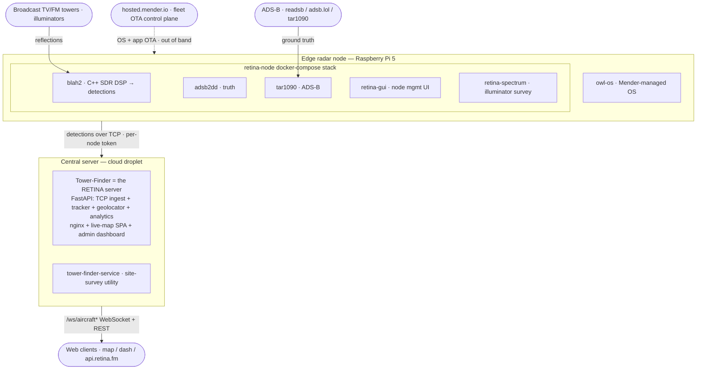
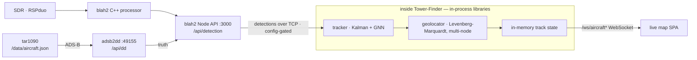
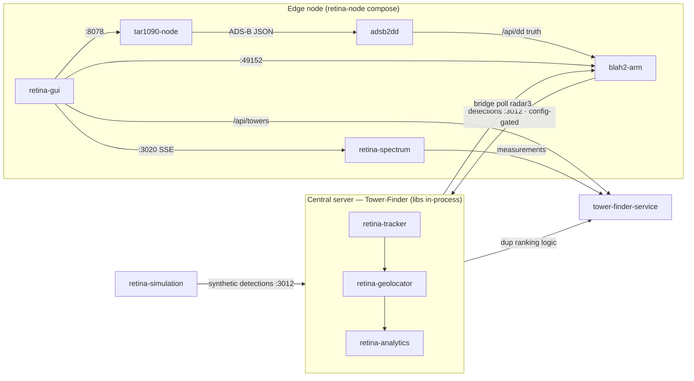
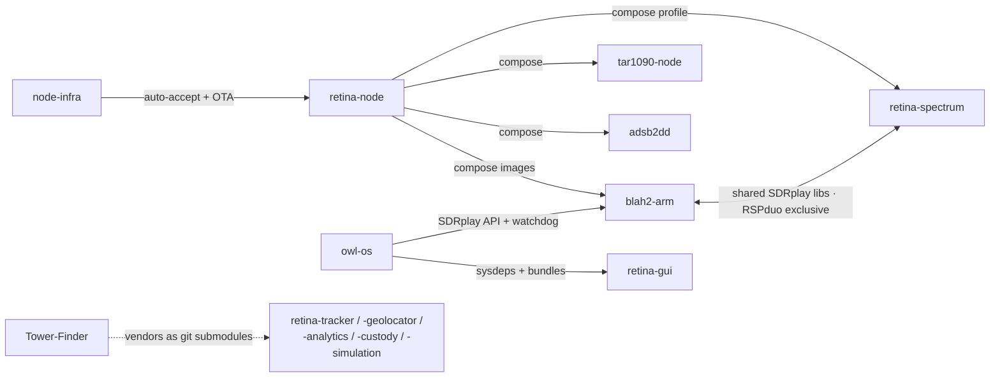

# RETINA System Architecture

RETINA — *Radio Echo Tracking by Inter-Node Analysis* — is an open-source
**distributed passive radar network**. Edge nodes listen for reflections of
existing broadcast transmitters (digital TV / FM illuminators of opportunity)
off aircraft, extract delay-Doppler detections locally, and forward them to a
central server that fuses detections from multiple nodes into tracked,
geolocated aircraft shown on live web maps.

> **Status of this document.** Derived from a survey of the `offworldlabs`
> repositories as of 2026-07-15, with interfaces read from code and config.
> Ports, endpoints, and component roles are cited from source; links that could
> not be confirmed from the repos are marked **(inferred)** or **(unverified)**.
> Update it as the system evolves — it is the org-wide reference the individual
> repos should point at rather than re-describe. Known gaps and inconsistencies
> found during the survey are tracked in separate tickets rather than listed here.

## 1. System context

Three tiers plus external inputs and an out-of-band control plane:

- **Edge radar node** — a Raspberry Pi 5 running `owl-os` with the `retina-node`
  Docker Compose stack. Captures IQ from an SDR (SDRplay RSPduo), computes
  delay-Doppler detections, and forwards them to the central server.
- **Central server** — the `Tower-Finder` monorepo (the repo name is historical;
  it is now the full RETINA server). Ingests detections from all nodes, runs
  multi-target tracking and multi-node geolocation, and serves the live maps.
- **Web clients** — the live map (`map.retina.fm`) and admin dashboard
  (`dash`/`admin.retina.fm`), served as static SPAs by the central server.
- **Control plane** — `hosted.mender.io` delivers OS and application updates to
  the fleet over the air; it is deliberately separate from the data plane.

## 2. Signal chain (data flow)

The production flow runs from an SDR at the edge to the live map, with the
tracker and geolocator running as libraries **inside** the central server:

**Caveat — the node→central forward is config-gated.** The "forwarded over TCP to
the central server" step depends on each node's merged `tracker_forward` config.
On the one production node inspected, forwarding was **disabled** (`enabled: false`,
base default `blah2_tracker:3012`, not the `retina` profile's
`tracker.retnode.com:30050`) — so this hop is not necessarily live fleet-wide.
Such a node still runs the full local pipeline (`blah2` + ADS-B truth) but doesn't
feed the central server.

**Ordering: tracker before geolocator.** A common summary of the pipeline lists
the geolocator before the tracker; the code is unambiguous the other way. The
**tracker runs first** (it turns detections into tracks) and the **geolocator
runs on the tracker's output** (it solves each track's geographic position) —
`retina-geolocator` consumes `retina-tracker`'s track output. Both run as
libraries inside the central server (see §3), not as separate services.

**Testing & simulation.** The pipeline is exercised without radio hardware by the
`retina-simulation` load harness, which streams synthetic detections for many
nodes to the central server's ingest port, alongside the server's own
synthetic-node handling.

**Live map feed.** Geolocated tracks reach the map *inside* the central server,
not via a file or tar1090's `aircraft.json`. Geolocation runs in-process
(`_run_geolocation()` during frame processing, updating an in-memory geolocated-
aircraft store in `backend/core/state.py`), and that state is broadcast over the
`/ws/aircraft*` WebSocket endpoints (`backend/routes/streaming.py`) to the live-map
SPA (`frontend/src/components/map/hooks.ts`). The standalone `retina-geolocator`'s
JSONL output is the offline/batch path, not the live feed.

## 3. Component catalogue

### Edge / on-node
- **blah2-arm** (C++ + Node API) — the passive-radar DSP engine (Raspberry Pi 5
  fork of blah2). Captures 2-channel IQ, computes delay-Doppler maps and
  in-processor tracks. REST API on `:3000` (`/api/detection`, `/api/map`,
  `/api/tracker`, …); web UI on `:49152`. Can forward detections to the central
  server. The core of the on-node stack.
- **adsb2dd** (Node/Express) — converts ADS-B aircraft positions into bistatic
  delay-Doppler "truth" for a given rx/tx/frequency. Polls a tar1090
  `/data/aircraft.json`; serves `/api/dd` and `/api/synthetic-detections` on
  `:49155`.
- **tar1090-node** (readsb + tar1090 + Node proxy) — ADS-B decode and map. A Node
  proxy (`:3005`) serves an enriched `aircraft.json` (adds anomaly / Mach flags)
  and disables readsb so synthetic data can drive the map; tar1090 renders on
  `:8504`.
- **retina-spectrum** (C++) — standalone RF spectrum-survey tool to pick
  illuminators; HTTP/SSE UI on `:3020`. Shares the single RSPduo with `blah2`, so
  it runs *instead of* the radar stack (opt-in `spectrum` compose profile).
- **retina-gui** (Python/Flask) — per-node management / onboarding UI baked into
  `owl-os` (systemd, `:80`, `owl.local`). Management plane, not data plane.

### Central server
- **Tower-Finder** (Python FastAPI + React/Vite SPAs) — the RETINA central server.
  One container (nginx + uvicorn) hosting: TCP detection ingest (`:3012`), the
  multi-target **tracker** (Kalman + GNN) and node associator, the multi-node
  **geolocator** (Levenberg-Marquardt), auth/admin/analytics, the live-map SPA,
  and the admin dashboard. Exposes REST `/api/*` and `/ws/aircraft*` WebSocket
  feeds behind `map`/`dash`/`api`/`testmap.retina.fm`. The tracking, geolocation,
  and analytics algorithms are **vendored as git submodules under `libs/`**
  (`retina-tracker`, `retina-geolocator`, `retina-custody`, `retina-simulation`,
  `retina-analytics`) and pip-installed into the image — those repos run *inside*
  this server, not as separate services.
- **tower-finder-service** (Python FastAPI) — the illuminator site-survey feature
  extracted into a standalone microservice (2026-05-20). Given a lat/lon it ranks
  nearby FM/VHF/UHF broadcast towers as candidate illuminators, querying external
  databases (Maprad.io, FCC). Fronted by the monorepo's nginx at
  `tower-finder.retina.fm`. Currently duplicates the tower code still present in
  the monorepo (deduplication pending).

### Tooling / simulation
- **retina-tracker** (Python library) — the multi-target tracker (Kalman/GNN). In
  production it is **not deployed standalone**: the central server vendors it as a
  `libs/retina-tracker` git submodule and imports it directly (e.g.
  `frame_processor`, `passive_radar`). Its own Dockerfile (a TCP service on
  `:30100`) is used only by `retina-tracker`'s integration-test compose.
- **retina-geolocator** (Python library) — LM delay/Doppler → lat/lon/alt/velocity
  solver (single- and multi-node). No network service; vendored into the central
  server as a `libs/` git submodule and also usable as a pip-installed batch tool
  for offline scripts.
- **retina-custody** (Python library) — cryptographic chain-of-custody for node
  data: node identity (`NodeIdentity`), signature verification (`SignatureVerifier`,
  `SoftwareCryptoBackend`), and tamper-evident hash chains (`HashChainBuilder`/
  `Verifier`). Makes each node's detections authenticated and tamper-evident.
  Vendored into the central server as a `libs/` submodule; imported by
  `backend/core/state.py`. *(Role derived from the central server's imports — the
  submodule isn't checked out locally.)*
- **retina-analytics** (Python library) — per-node analytics and trust: inter-node
  detection association (`InterNodeAssociator`), node reputation and trust scoring
  (`NodeReputation`, `TrustScoreState`, `AdsReportEntry`), coordinated by a
  `NodeAnalyticsManager`. Vendored into the central server as a `libs/` submodule;
  drives live state and the `/api/analytics` route. *(Role derived from the central
  server's imports — the submodule isn't checked out locally.)*
- **retina-simulation** (Python) — fleet load-test harness; streams detection
  frames for 100–1000 synthetic nodes to a RETINA server over TCP (`:3012`).
- **radar-replay** (Python/Flask) — records a live node's API to JSONL and replays
  it through the same API (`:8090`) for offline debugging.

## 4. Deployment & fleet lifecycle

**On each edge node:**
- **OS layer** — `owl-os`: a Mender-enabled Debian bookworm arm64 image for the
  Pi 5, built with EDI. A/B-partitioned for safe rollback; ships Docker, the
  SDRplay API, Chrony, Cloudflared, Avahi (`owl.local`), a WiFi captive portal,
  and the Mender client.
- **Application layer** — the `retina-node` Docker Compose stack (images from
  `ghcr.io/offworldlabs/*`): `config-merger` (runs once to merge
  `default → user → forced` config into `config.yml` + `.env`), then `blah2`,
  `blah2_web/api/host`, `tar1090`, `adsb2dd`, and optional `retina-spectrum`. A
  node's data-plane target (central collector host + token, ADS-B source) is
  selected by a network *profile* applied at "forced" precedence so it can't be
  overridden by local edits.

**Build → provision → update:**
1. **Build** — tagged CI builds produce Mender artifacts: `owl-os` (`os-v*`) builds
   the full OS image + `.mender`; `retina-node` (`v*`) builds the compose bundle
   into a `.mender` artifact plus the `config-merger` GHCR image.
2. **Provision** — flash the OS image → WiFi captive-portal onboarding → the node
   registers as *pending* on `hosted.mender.io` → `node-infra/mender-auto-accept`
   (a 30-second systemd timer on the central server) auto-approves nodes matching
   an ID prefix → the `retina-node` stack is deployed via Mender OTA →
   `config-merger` applies location/network config.
3. **Update** — push new `.mender` artifacts (app bundle and/or full A/B OS image)
   through Mender; A/B partitioning + verified reboot gives safe rollback.
   Switching the *data-plane* network is automated; switching the *OTA control*
   plane is intentionally manual.

**Central / cloud:** the `Tower-Finder` monorepo container + `tower-finder-service`
run on a DigitalOcean droplet, joined by a shared `retina-edge` Docker network and
fronted by Cloudflare; both deploy via `git reset --hard origin/main` +
`docker compose up -d --build` from GitHub Actions on push to `main`. The public
marketing site is a separate static repo (`landing-page-retina`).

### Live endpoints

Hostnames seen in code/config, and what serves them. Treat as a pointer, not an
authoritative inventory — deployment topology changes faster than this table.

| Endpoint | Role |
| --- | --- |
| `radar3.retnode.com`, `sfo1.retnode.com` | Real production radar nodes (detection APIs) |
| `api.retina.fm` | Central server REST/API surface |
| `tower-finder.retina.fm` | `tower-finder-service` (illuminator site-survey) |
| `towers.retina.fm` | Tower search API (queried by `retina-simulation` for TX coords) |
| `map.retina.fm`, `dash`/`admin.retina.fm`, `testmap.retina.fm` | Central server live-map / dashboard SPAs |
| `retina.fm` | Deployment / product portal |
| `offworldlabs.com` | Marketing site (`landing-page-owl`) |
| `owl.local` / `retina.local` | On-node `retina-gui` management UI (LAN) |

## 5. Repository map

| Repo | Role | Stack |
| --- | --- | --- |
| `blah2-arm` | On-node SDR DSP engine + API | C++, Node |
| `adsb2dd` | ADS-B → delay-Doppler truth | Node/Express |
| `tar1090-node` | ADS-B decode + map + proxy | readsb, nginx, Node |
| `retina-spectrum` | Illuminator spectrum survey | C++ |
| `retina-gui` | Node management UI | Python/Flask |
| `Tower-Finder` | Central RETINA server (ingest, track, geolocate, maps) | Python/FastAPI, React/Vite |
| `tower-finder-service` | Illuminator site-survey microservice | Python/FastAPI |
| `retina-tracker` | Multi-target tracker (Kalman/GNN) — library vendored into central server | Python |
| `retina-geolocator` | LM delay/Doppler → position solver — library vendored into central server | Python |
| `retina-custody` | Node identity + signature/hash-chain custody — library vendored into central server | Python |
| `retina-analytics` | Inter-node association + node reputation/trust — library vendored into central server | Python |
| `retina-simulation` | Fleet load-test harness — library vendored into central server | Python |
| `radar-replay` | Record/replay debug tool | Python/Flask |
| `retina-node` | On-device compose bundle + OTA packaging | Compose, Python |
| `owl-os` | Pi 5 OS image builder (Mender/EDI) | EDI, Ansible |
| `node-infra` | Central fleet automation (Mender auto-accept) | Python |
| `landing-page-retina` | RETINA public marketing site | Static HTML |
| `landing-page-owl` | Owl product landing page (placeholder/template at last survey) | Static HTML |
| `docs` | Documentation container (passive-radar theory memo PDF + pointers) | Markdown, PDF |
| `claude-shared` | Org-wide Claude Code resource: `core` plugin marketplace + shared reference docs (this repo) | Markdown, plugins |

## 6. Cross-repo connections

Two views of how the repos wire together — **runtime data/API calls**, and
**build/deploy/hardware coupling**. The exhaustive who-calls-whom matrix is kept
collapsed below as the precise reference (it also records where repos *don't* connect).

### Runtime data & API calls

### Build / deploy / hardware coupling

<b>Exhaustive connection matrix</b> — every edge, including where repos don't connect

Rows call/depend on columns. **Format** = detection/track/geolocation JSONL. **HW** =
shares SDRplay hardware/libs. **compose** = deployed together. **lib** = vendored as a
git submodule and imported in-process. **HTTP** = REST/proxy.

| From ↓ / To → | blah2-arm | adsb2dd | tar1090-node | retina-spectrum | retina-tracker | retina-geolocator | retina-analytics | tower-finder-service |
|---|---|---|---|---|---|---|---|---|
| **retina-node** | compose | compose | compose | compose (excl.) | – | – | – | URL env |
| **blah2-arm** | – | HTTP `/api/dd` | – | HW libs | Format (forward¹) | – | – | – |
| **retina-gui** | HTTP :49152 | – | HTTP :8078 | SSE proxy :3020 | – | – | – | HTTP `/api/towers` |
| **Tower-Finder** | bridge (radar3) | Format | – | – | lib (in-process²) | lib (in-process²) | lib | dup logic |
| **retina-tracker** | Format (in) | Format (adsb) | – | – | – | Format (out) | – | – |
| **retina-geolocator** | reads config.yml | – | – | – | Format (in) | – | Format (out) | – |
| **retina-simulation** | – | – | – | – | Format→:3012 | – | – | towers API |
| **retina-spectrum** | HW libs | – | – | – | – | – | – | HTTP profile |
| **owl-os** | sysdeps | – | sysdeps | bundled? | – | – | – | – |
| **node-infra** | via retina-node | via retina-node | via retina-node | via retina-node | – | – | – | URL passthrough |

¹ The node→central detection forward is **config-gated** and was `disabled` on the
production node surveyed (§2) — this hop is not necessarily live fleet-wide.

² `retina-tracker` / `retina-geolocator` / `retina-analytics` run **inside** the central
server as imported libraries (e.g. `_run_geolocation()` during frame processing), not as
separate services or subprocesses. Their standalone TCP/Docker entry points exist only for
each repo's own integration tests (§3).

